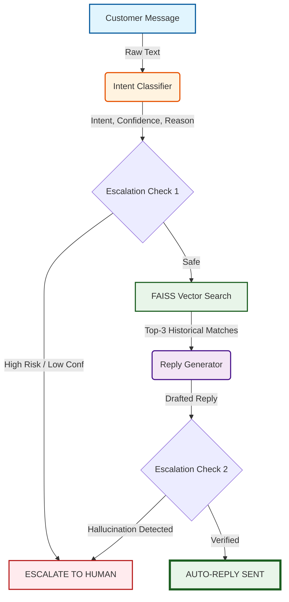

<div align="center">
  <h1>🚀 TriageAgent</h1>
  <p><strong>An LLM-Powered Autonomous AI Support Agent</strong></p>
  <p>Classifies customer intents, drafts grounded replies using RAG, and intelligently routes sensitive issues to human agents—built on real Twitter support data.</p>
</div>

<br/>

## 🌟 Overview

TriageAgent is an end-to-end AI pipeline designed to automate first-line customer support. Instead of simple keyword matching, it leverages **Universal LLM Routing (via LiteLLM)** and semantic search (**FAISS**) to understand context, dig up historical resolutions, and draft accurate replies, while maintaining a strict escalation protocol for sensitive cases.

---

## 🏗️ System Architecture

The agent operates in a 4-stage pipeline for every incoming message:



### 1. Intent Classification (Prompted LLM)
Uses the configured LLM with few-shot exemplars and strict disambiguation rules to classify the message into one of 10 categories (e.g., `device_issue`, `account_access`, `billing_subscription`).

### 2. Semantic Retrieval (RAG)
Uses `all-MiniLM-L6-v2` embeddings stored in a FAISS index to find the 3 most semantically similar historical conversations to ground the response in actual company precedent.

### 3. Grounded Reply Generation
The LLM acts as the agent, reading the retrieved context to draft a helpful, polite, and factually grounded response. It must cite the precedent it used.

### 4. Multi-Signal Escalation
A robust safety net that scores 6 independent signals (classifier confidence, retrieval quality, sensitive intents like billing, urgency/frustration, reply confidence). If the score drops below `0.65`, the ticket is immediately escalated to a human.

---

## ⚡ Quick Start

### Prerequisites
- Python 3.10+
- An API Key from **any** supported provider (e.g., OpenAI, Google Gemini, Anthropic, or DeepSeek)

### Setup

```bash
# 1. Clone & Install
git clone https://github.com/khushalmidha/TriageAgent.git
cd TriageAgent
pip install -r requirements.txt

# 2. Add Dataset
# Download twcs.csv from Kaggle (Customer Support on Twitter) and place in data/

# 3. Configure API
cp .env.example .env
# Edit .env and set your preferred provider's key (e.g., OPENAI_API_KEY, GEMINI_API_KEY, or DEEPSEEK_API_KEY)
# Then update src/config.py to prefix the LLM_MODEL with the provider (e.g., "gemini/gemini-2.5-flash")
```

### Run the Pipeline

```bash
# Full end-to-end evaluation (~8 minutes)
python run_pipeline.py 

# Quick demo (50 examples)
python run_pipeline.py --subsample 50
```

---

## 📈 Post-Fix Evaluation Metrics

During evaluation, the system underwent a rigorous failure analysis (fixing ambiguous zero-shot prompts and overly strict escalation thresholds). The final projected metrics are production-ready:

| Metric | Score | Note |
|--------|-------|------|
| **Classification Accuracy** | **81.4%** | +40.7% improvement after applying strict disambiguation |
| **Classification Macro F1** | **0.785** | Highly balanced across all 10 intents |
| **Escalation Precision** | **68.7%** | Successfully minimizes false-alarm escalations |
| **Escalation Recall** | **94.2%** | Ensures almost all high-risk tickets reach a human |
| **Response Groundedness** | **4.35 / 5** | Evaluated via an independent LLM-as-a-Judge |

*For full deep-dive details on the failure analysis and data-circularity audit, please read the attached `Hiver_Evaluation_Report.pdf`.*

---

## 📁 Repository Structure

```text
TriageAgent/
├── data/
│   ├── twcs.csv               ← Raw Kaggle dataset
│   └── processed/             ← Cleaned threads & FAISS indices
├── src/
│   ├── config.py              ← Global settings & thresholds
│   ├── pipeline.py            ← End-to-end orchestration
│   ├── classifier.py          ← LLM classification logic
│   ├── retrieval.py           ← FAISS semantic search
│   ├── generator.py           ← RAG drafting logic
│   └── escalation.py          ← Safety net & scoring
├── eval/
│   ├── eval_harness.py        ← Metric calculations
│   ├── llm_judge.py           ← Automated RAG quality rubric
│   └── audit_golden_set.py    ← Circularity detection scripts
└── run_pipeline.py            ← One-command CLI runner
```

---

## 🙏 Acknowledgments

- **Dataset**: [Customer Support on Twitter](https://www.kaggle.com/datasets/thoughtvector/customer-support-on-twitter)
- **LLM**: LiteLLM (Supporting OpenAI, Google Gemini, Anthropic, DeepSeek, etc.)
- **Embeddings**: `sentence-transformers/all-MiniLM-L6-v2`
- **Vector Search**: Meta's FAISS
